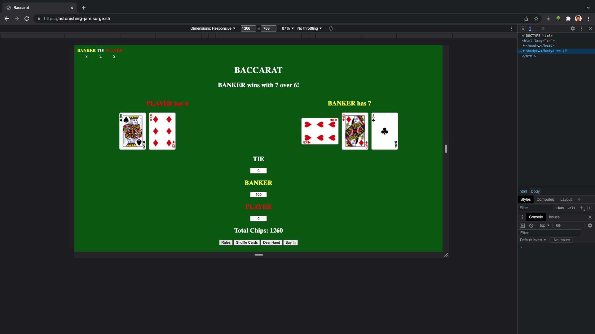
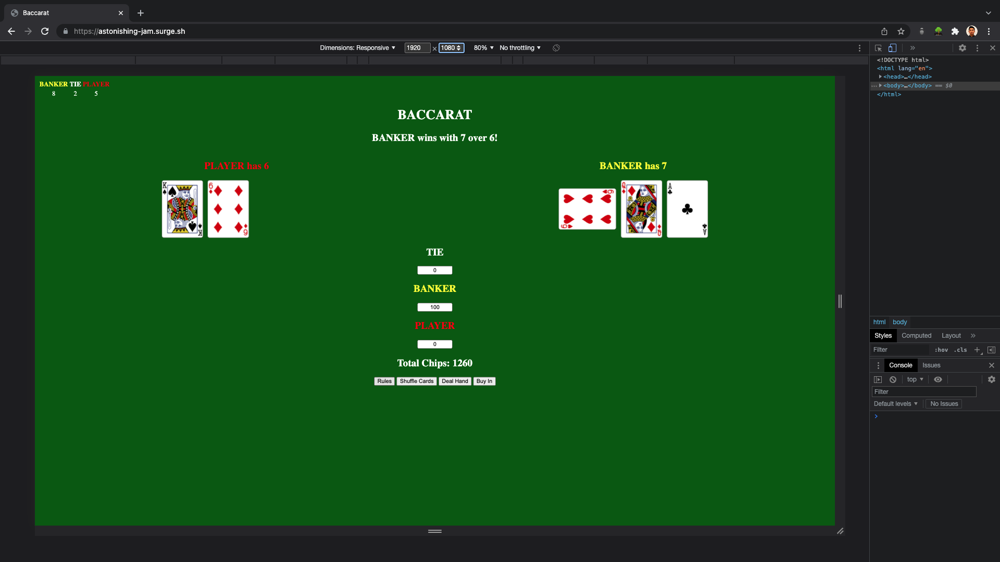
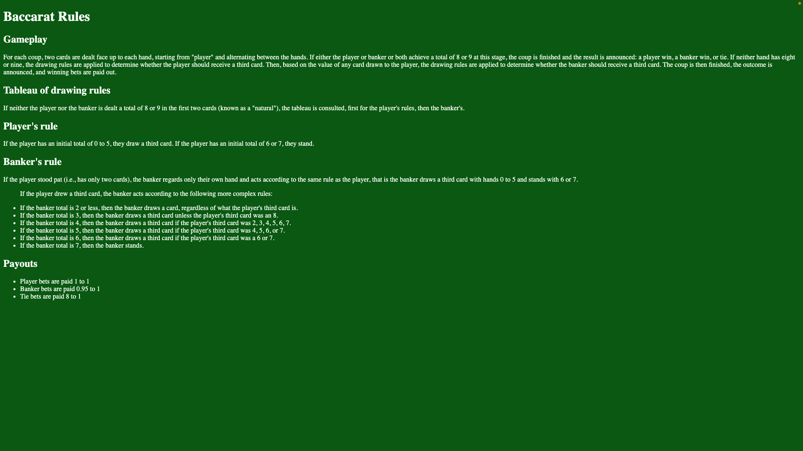

# Baccarat
## Date 3/7/2022

### By: David Wu

#### [GitHub](https://github.com/dwu621) | [LinkedIn](www.linkedin.com/in/dwu621)
***

### ***Description***
Baccarat is a compare game where the "Banker" and the "Player" are dealt two cards each. The total value of the cards are used to determine if either will draw a third card. If no card is drawn, then the hand with the high value will win. If the conditions are met for a third card is drawn, then the comparison will be done after third card is drawn. If both values are the same, then the outcome is a tie. The total is calculated by adding the value of the cards, where "Ace" through "9" is worth their numeric value and "10", "Jack", "Queen", "King" are worth 10, and then only using the last digit as the total value of the hand. The game is played by betting on the outcome of each hand. "Player" bets are paid 1 to 1. "Banker" bets have to pay a 5% commission. "Tie" bets are padi 8 to 1.

#### A brief description of the project...
This project is based on the card game played at casinos with the same name. I will be using Axios and deck of cards api to make a virtual shoe consisting of 8 decks of cards. Images of cards and the drawing of cards will also be done. The game table will be pretty basic consisting of divs. I will be using mostly if/else statements for game logic and DOM manipulation to change card images and display messages.

### ***Technologies Used***
* HTML
* CSS
* JavaScript
* Axios
***

### ***Getting Started***
* Set up basic table with divs and buttons
* Set up variables to keep track of components of the game
* Plan out game flow.
* Write functions for each game flow
* If time permits add Dragon/Bonus

#### Development Progress can be viewed [here](https://trello.com/b/2TYwLeAV/baccarat#)
#### Final Project can be viewed [here](https://astonishing-jam.surge.sh)
***

### ***ScreenShots*** 

##### iPhone View

##### iPad View

##### Laptop View

##### Desktop View

##### Rules

*** 

### ***Future Updates***
~~- [X] Add Responsiveness~~
- [ ] Add Bonus Feature like Dragon/Panda

***

### ***Credits***

##### Deck of Cards API: (https://deckofcardsapi.com)

##### Wikipedia: (https://en.wikipedia.org/wiki/Baccarat)

##### Wireframe: (https://wireframe.cc)

##### Trello: (https://trello.com)

##### GitHub: (https://github.com/public-apis/public-api)

##### w3schools: (https://w3schools.com)